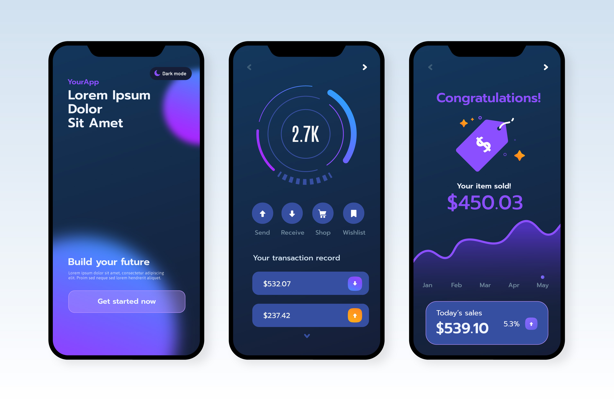

> [!WARNING]
> O aplicativo possui um erro nas transições entre páginas, ao clicar para entrar o aplicativo vai para a home, porém, não retorna e nem avança.

O aplicativo foi desenvolvido para a N1 da matéria de Desenvolvimento de Dispositivos Móveis.

O Front o aplicativo foi desenvolvido a partir de um mockup, escolhido da internet.

Este app possui as seguintes funcionalidades a serem desenvolvidas:

· Criação de Conta

    Os usuários podem criar uma conta fornecendo informações básicas, como nome, endereço de e-mail e senha.

· Envio e Recebimento de Mercadorias

    Os usuários podem listar mercadorias que desejam trocar ou vender

    Adicionar fotos e descrições detalhadas das mercadorias, pesquisar mercadorias disponíveis para compra ou troca

    Solicitar trocas e compras diretamente no aplicativo, sistema de mensagens internas

    Feedbacks após a conclusão da transação e uma loja interna.

· Loja Interna

    Os usuários podem criar uma loja virtual dentro do aplicativo.

    Adição de produtos à loja com imagens, descrições e preços.

    Possibilidade de gerenciar o estoque de produtos na loja.

    Os usuários podem comprar produtos de outras lojas internas.

· WishList

    Os usuários podem adicionar produtos à sua lista de desejos.

    Notificações sobre descontos ou disponibilidade de produtos na lista de desejos.

    Opção de compartilhar a lista de desejos com outros usuários.

· Consulta de Saldo

    Visualização do saldo atual na conta do usuário.

    Histórico de transações detalhado, incluindo compras, vendas e trocas.

· Gráfico de Desempenho de Vendas

    Exibição de gráficos e estatísticas de vendas do usuário.

    Dados sobre as transações concluídas ao longo do tempo.

    Comparação de desempenho com outros usuários (opcional).

· Integração de Pagamento:

    Implementação de métodos de pagamento seguros para compras dentro do aplicativo.

    Possibilidade de realizar transações financeiras diretamente no aplicativo.

· Suporte ao Cliente

    Canais de suporte para dúvidas, reclamações e problemas técnicos.

    Resposta rápida a consultas de usuários.

· Segurança e Privacidade

    Medidas de segurança robustas para proteger informações pessoais e financeiras dos usuários.

    Política de privacidade clara e transparente.

Como executar/importar o projeto:

    · Certifique-se de que o Flutter esteja na versão 3.10.1 e o Dart na versão 3.0.1;

    · Importe o projeto para sua IDE de preferência (eu estou utilizando o Android Studio Giraffe | 2022.3.1 Patch 1);

    · Certifique-se de que a IDE esteja com os plugins Flutter e Dart instalados nas versões citadas acima;

    · Vá em File > Settings > Languages & Frameworks > Flutter e insira o caminho da pasta do SDK do Flutter em Flutter SDK path;

    · Abra o arquivo pubspec.yaml e clique em pub get para que as dependências (pacotes) utilizadas no projeto sejam carregadas;
    
    · Execute a aplicação.

